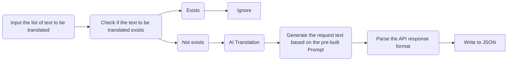
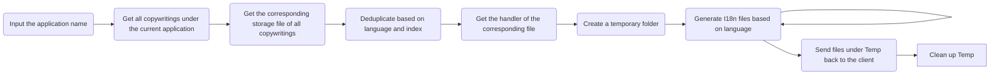

# gpt-translate

Simple Translate App with OpenAI gpt api 

## System Design

### Relation

> Create a Chinese index JSON file that stores all translated texts, and check if a corresponding translation exists by reading this file

```typescript

/**
 * core
 **/

type Lang = string;

interface IndexJsonFile {
    [copyWriting: string]?: {
        lang: Lang;
        index: number;
    }[];
}

/**
 * Relationship between application and copywriting
 **/

interface AppCWsFile {
    [app: string]?: keyof IndexJsonFile[];
}

```

### CopyWriting
> Considering the performance limitations of Steno, split specific languages into files less than 100MB, with the split rule as {language}-{index}.json

```typescript

type CN = string;
type I18n = string;

/**
 * file structure
 * 
 * fileName: {I18n}-{index}.json
 * 
 **/

interface CopyWritingFile {
    [text: CN]?: I18n;
}

```

### Complete logical chain for Translate



### Complete logical chain for Generator I18n File

