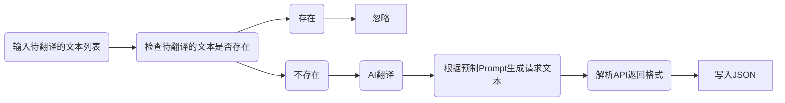
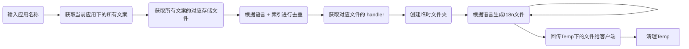

# gpt-translate

使用 OpenAI GPT API 的简单翻译应用

## 系统设计

### 关系

> 创建一个中文索引 JSON 文件，存储所有翻译文本，并通过读取该文件来检查是否存在相应的翻译。

```typescript

/**
 * 核心
 **/

type Lang = string;

interface IndexJsonFile {
    [copyWriting: string]?: {
        lang: Lang;
        index: number;
    }[];
}

/**
 * 应用和文案之间的关系
 **/

interface AppCWsFile {
    [app: string]?: keyof IndexJsonFile[];
}

```

### 文案

> 考虑到 Steno 的性能限制，将特定语言拆分为小于 100MB 的文件，拆分规则为 {language}-{index}.json。

```typescript

type CN = string;
type I18n = string;

/**
 * 文件结构
 * 
 * 文件名：{I18n}-{index}.json
 * 
 **/

interface CopyWritingFile {
    [text: CN]?: I18n;
}

```

### 完整的翻译逻辑链路



### 完整的生成 I18n 文件的逻辑链路

